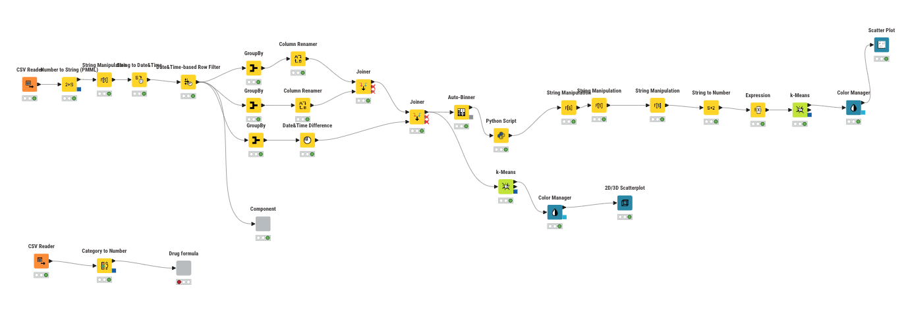
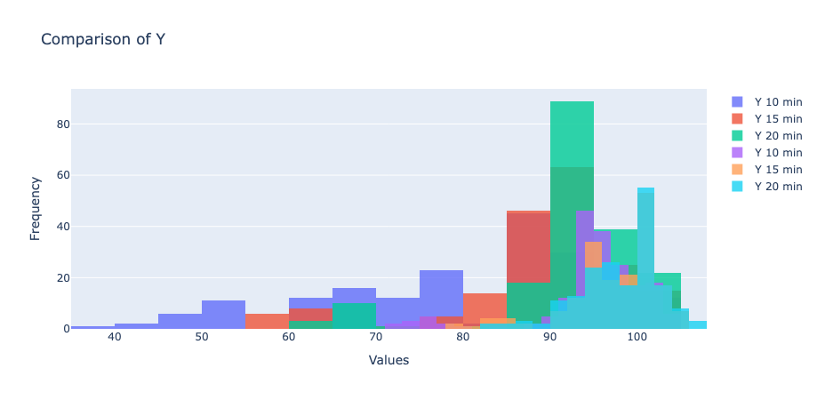
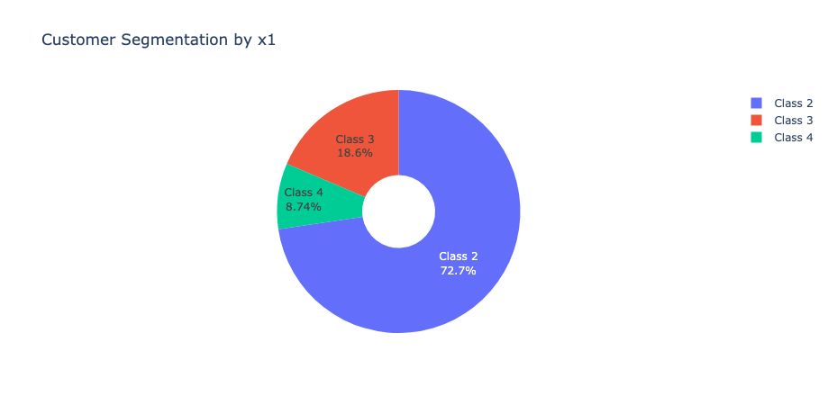
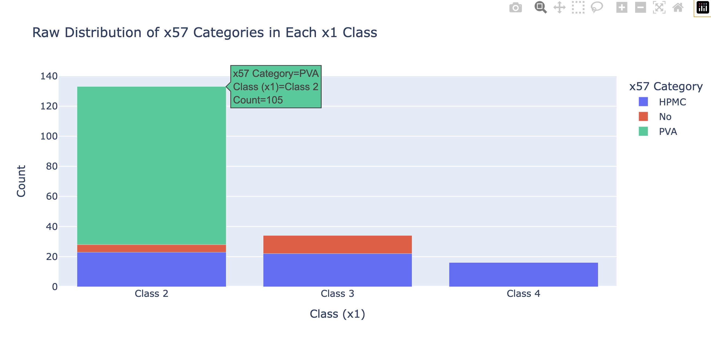
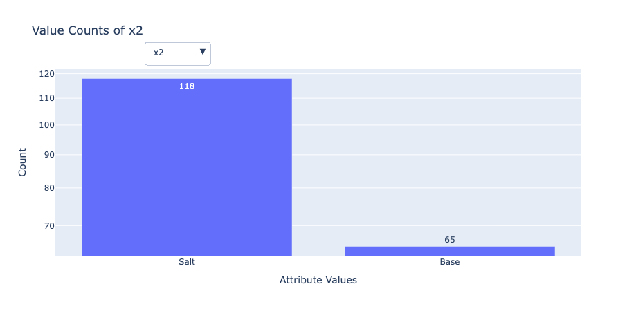

# AI Projects for Government Pharmaceutical Organization (GPO)

This project showcases two AI-driven solutions developed for the **Government Pharmaceutical Organization (GPO) of Thailand** using the **KNIME Analytics Platform**. The goal is to enhance customer insights and enable reverse formulation prediction using pharmaceutical sales and production data.

---

## Project 1: Customer Segmentation

### Objective
Segment customers based on drug sales data to improve:
- Targeted marketing
- Inventory planning
- Distribution strategies

### Approach
- Preprocessed and analyzed sales data using **KNIME**
- Applied clustering algorithms like **K-Means**
- Created customer profiles based on behavior and purchase patterns

### EDA

---

## Project 2: Reverse Formula Prediction

### 🎯 Objective
Predict raw material combinations (`X1, X2, ..., Xn`) from desired output results (`Y1, Y2, ..., Yn`).

### 🧠 Approach
- Modeled reverse mapping using regression in **KNIME**
- Reduced trial-and-error in pharmaceutical R&D

---

## 🛠️ Tools & Technologies
- **KNIME Analytics Platform**
- Clustering: K-Means, Hierarchical
- Regression: Random forest, MultiOutputRegressor
- Visualization: KNIME native plotting tools

---

## 📁 Files Included

- `AI_GPO.knwf` – Main KNIME workflow
- `ETL_data.csv` – Sample drug formula used in the workflow
- `Sales.csv` - Sample sales dataset used in the workflow
- `drug.ipynb` - extract data to joblib model 
---

## 📥 How to Use

1. Open **KNIME Analytics Platform**
2. Go to `File` → `Import KNIME Workflow...`
3. Select `AI_GPO.knwf` to import
4. Run the workflow and explore the nodes

---

## 📌 Impact

These AI tools help the GPO make better data-driven decisions—from segmenting customers to designing drug formulas more efficiently.
